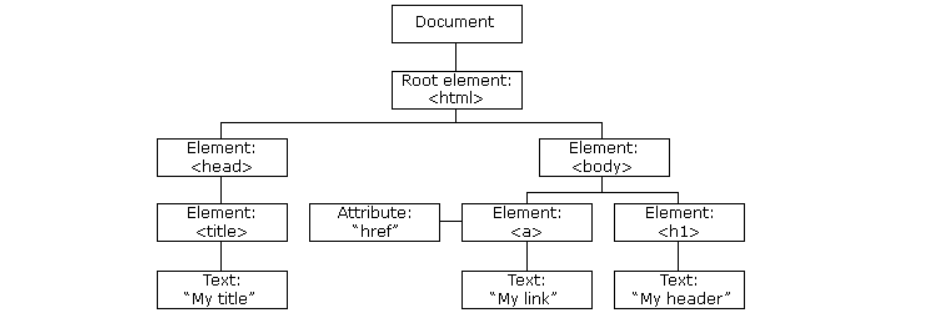

### 📅 created : 2021.03.03
### 📅 updated : 2021.03.03
### 📝 content : DOM과 Layout Trees

---

## 📝 DOM

### 📜 DOM에 들어가기 앞서...

- 브라우저와 관련된 객체 집합을 부라우저 객체 모델(Browser Object Model, BOM)이라고 한다
- BOM을 이용하여 브라우저와 관련된 기능을 구성한다
- DOM은 BOM 중 하나이다

✏️ DOM이란 ?
- 문서 객체모델(Document Object Model)의 약자이다.
- `Model`은 문서 객체를 인식하는 방식을 의미
- DOM은 자료구조 중 트리(Tree)의 형식을 취하고 있다.

DOM에서 중요한 규칙은 문서를 트리 구조로 표시하는 것이다.

이러한 형태를 노트 트리라고 한다.

### 📋 DOM의 장점

- 사용자에 의해서 얼마든지 페이지의 데이터를 업데이트 할 수 있다
- 레이아웃 등을 refresh 과정 없이 커스터 마이징 가능

### 📋 DOM의 문제점

- 동적 UI에 최적화 되어있지 않음
- 브라우저 단에서 DOM 변화가 일어나면 부라우저가 CSS를 다시 연산한 다음 레이아웃을 구성하고 웹페이지를 다시 그리는 과정에서 시간이 소요 됨
  - 현재 이 문제를 해결하기 위해서 최소한의 DOM 조작을 통해서 작업을 처리하는 방식으로 개선되고 있다. 
  - 현재 많은 프레임워크에서 `가상 DOM 방식`을 사용하여 DOM 업데이트를 추상화해서 DOM 처리 횟수를 최소화하는 방식을 취하고 있다.

### 📋 문서 객체가 생성되는 방식

1. 웹 브라우저가 HTML 페이지에 적혀 있는 태그를 읽으면 생성
2. 원래 HTML 페이지에 없던 문서 객체를 JS를 이용해서 생성

1번을 `문서 객체를 정적으로 생성`, 2번을 `문서 객체를 동적으로 생성`한다고 표현한다.

### 📋 A Browser's Workflow(워크 플로어)

1. DOM Tree가 생성된다
2. Render Tree가 생성된다
3. Layout(Reflow라고 한다)
4. Painting(페인팅)

Virtual Dom에 대해서는 13_virtual_dom에서 계속해서 설명하겠습니다.

---

📰 참조

1. https://corock.tistory.com/471
2. https://code-masterjung.tistory.com/33
